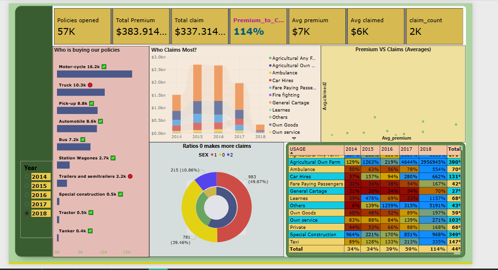

# Insurance Premium & Claims Analysis

## Project Overview
This Power BI project analyzes insurance policies, premium collections, and claims trends...

## Dashboard Preview

- Compared premium vs claims
- Analyzed yearly trends (2014–2018)
- Usage-wise claim patterns

## Dataset Description
The dataset contains insurance policy records including:
- Policy type
- Customer category
- Premium amount
- Claim amount
- Year of transaction
- Usage type

Data covers period from 2014 to 2018 and helps analyze business performance

## Business Problem
The insurance company wants to understand:
- Which policies generate highest premium
- Which categories claim the most
- Premium vs claim comparison
- Risk segments and loss patterns

Goal is to improve profitability and customer targeting.

## KPIs
- Total Policies Opened
- Total Premium
- Total Claims
- Premium to Claims Ratio
- Average Premium
- Average Claimed Amount
- Claim Count

## File
- Insurance Premium & Claims Analysis.pbix

## Tools Used
- Power BI Desktop
- DAX
- Power Query

## Key Insights
- Identified top policy buyers
